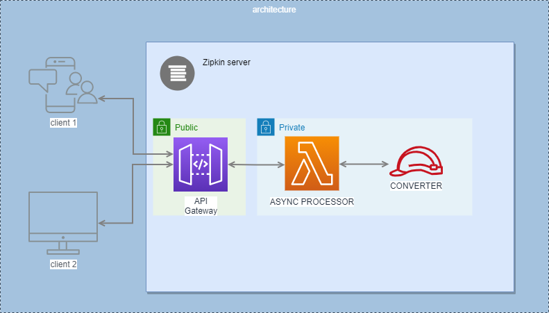
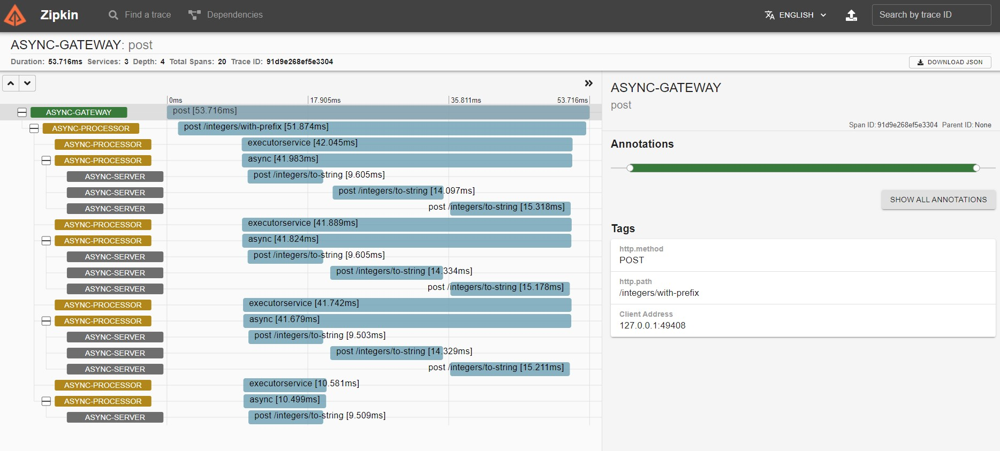

# Async processor

A simple project with async processes using CompletableFuture with timeout.

## Architecture

`client <----> gateway <----> async-processor <----> converter`



## How to start

1. `java -jar zipkin-server/zipkin.jar` -> it will start the Zipkin server on `http://localhost:9411/zipkin`
2. `./eureka-server/mvn spring-boot:run` -> it will start the Eureka server on `http://localhost:8761`
3. `./gateway/mvn spring-boot:run` -> it will start the gateway on `http://localhost:8080`
4. `./async-processor/mvn spring-boot:run` -> it will start the async-processor on `http://localhost:8181`
5. `./converter/mvn spring-boot:run` -> it will start the converter on `http://localhost:8182`

## Sample requests and responses

Sample request:
```http request
### convert integers to string with prefix
POST http://localhost:8080/integers/with-prefix
Content-Type: application/json

{ "integers": [1, 2, 3, 4, 5, 6, 7, 8, 9, 10], "prefix": "tmp"}
```

Sample response:
```json
[
  "tmp1", "tmp2", "tmp3", "tmp4", "tmp5", "tmp6", "tmp7", "tmp8", "tmp9", "tmp10"
]
```

Traceability:

We can see in the image above there are 4 spawned threads in `async-processor` (_we configured `app.async.processor.thread-count=4`_)
and each thread is processing `integers.size()/preferredThreadCount=(10/4)+1=3` integers.
The integers inside each thread are processed sequentially.

For more request please see `./resources/requests.http`

